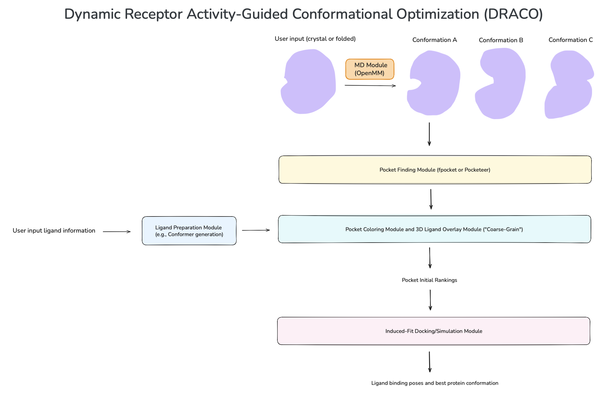

# draco

**D**ynamic **R**eceptor **A**ctivity-Guided **C**onformational **O**ptimization

A computational pipeline for SAR-guided conformational sampling and cryptic binding site discovery.

## Workflow

## Project Plan

See [`project_plan.md`](project_plan.md) for the full project plan and methodology.

## Pocket Coloring Prototype

The repository now includes two early-stage modules for the alpha-sphere workflow:

- `ligand_preparation.py`: prepares ligands from SMILES or files into 3D conformers plus ligand color/pharmacophore points.
- `pocket_coloring.py`: colors `pocketeer` alpha-spheres from local protein context and computes ROCS-like `ShapeTanimoto`, `ColorTanimoto`, and `TanimotoCombo` scores for ligand overlays.

The notebook [`pocketeer_module.ipynb`](pocketeer_module.ipynb) includes a demo section that runs the new workflow after `pocketeer` pocket detection.
