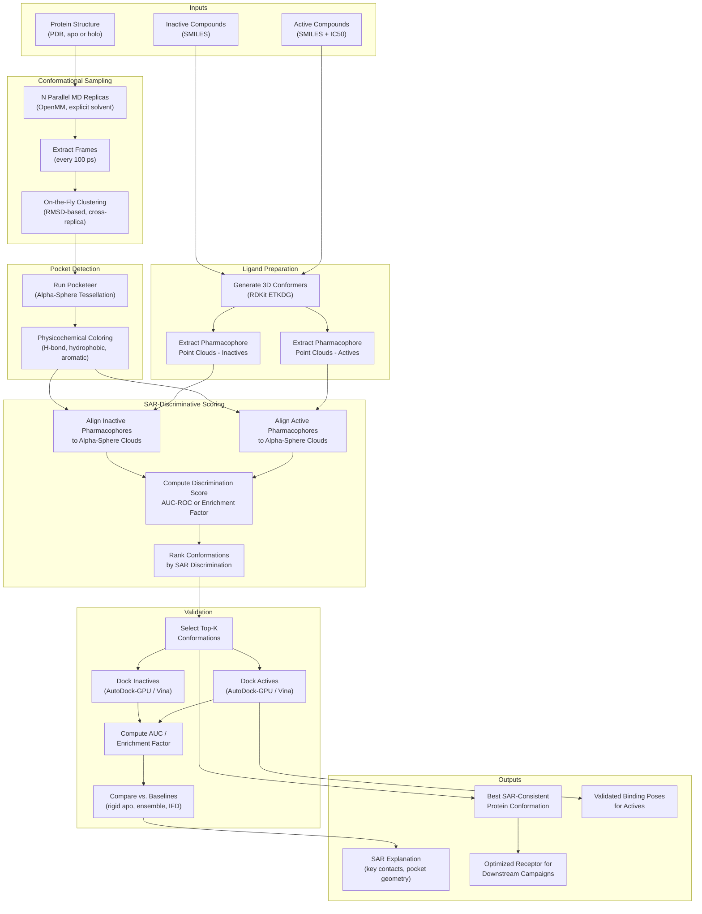
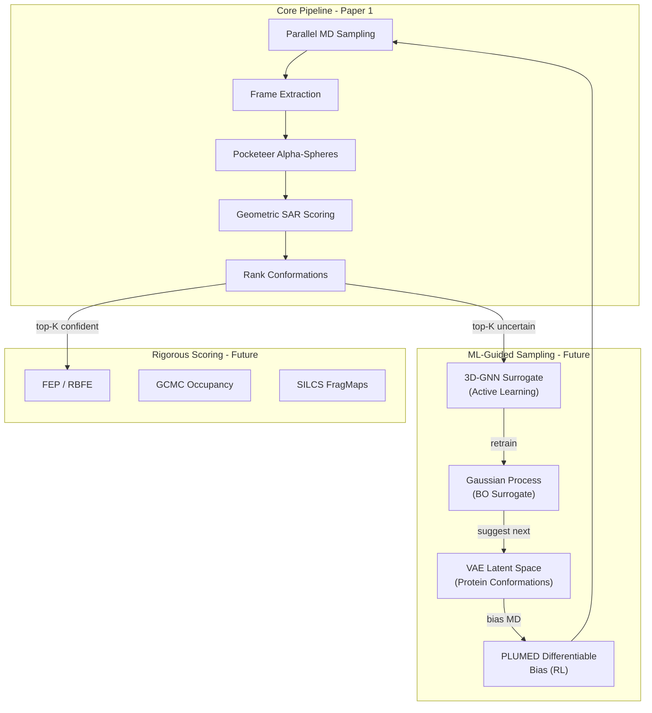

# Project Plan 10mar2026

### Summary: SAR-Guided Conformational Sampling for Binding Site Discovery

**The Problem**

Drug discovery campaigns frequently identify hit compounds and establish structure-activity relationships (SAR), yet fail to produce credible binding poses through conventional docking. This failure is not always a ligand problem — it is often a protein problem. The receptor is flexible, the relevant binding conformation is not captured in available crystal structures, and cryptic or allosteric pockets may only open in the presence of a ligand or under particular dynamic conditions. Standard flexible docking methods insufficiently address this because they treat protein flexibility as a local refinement problem rather than a global conformational sampling problem.

The deeper issue is that the field has tools for each sub-problem in isolation, but no unified framework that brings them together in a physically coherent way.

**The Core Vision** 

A unified, open-source framework that accepts:

- A protein structure (PDB, apo or holo)
- A ligand series with associated activity information (actives/inactives, ranked potency, or IC50s)

And produces:

- A protein conformation (and associated pocket geometry) consistent with the SAR data
- Validated binding poses for active compounds
- An explanation of why inactive compounds fail to bind
- A receptor conformation suitable for downstream rigid docking campaigns

The binding site may be known or unknown. If unknown, the framework should operate in a blind mode capable of detecting cryptic or allosteric sites through conformational sampling.

**Key Requirements**

1. **Conformational sampling must be exhaustive and physically meaningful:** The protein cannot be treated as rigid or semi-rigid. The framework needs to explore the genuine conformational ensemble of the receptor, including states that are not represented in any experimental structure.
2. **The activity data must actively guide the search:** This is the central novelty. Actives and inactives are not just validation data — they are a discriminative signal that constrains which protein conformations and binding modes are physically plausible. A conformation that docks actives well but also docks inactives equally well is not a valid solution.
3. **Inactives must be treated as first-class constraints:** No existing tool uses inactives as negative constraints on rotamer assignment or pocket geometry. The framework should use inactive compounds to restrict the conformational and rotamer space — explaining failures is as important as explaining successes.
4. **The scoring function is open:** Empirical docking scores are fast but lack statistical mechanics grounding. Free energy-based methods (such as GCMC occupancy, SILCS FragMaps, or funnel metadynamics) are more rigorous but more expensive. The framework should be agnostic to this choice; the architecture should support both, with the understanding that rigor and computational cost exist on a spectrum and the appropriate choice depends on the campaign stage.
5. **The output must be practically useful:** The end product is not just a scientific result — it is a receptor conformation that a medicinal chemist can use in a rigid docking campaign, or pass directly into FEP for SAR expansion. Interpretability matters: which residues are SAR-determining, which contacts distinguish actives from inactives, and what the pocket geometry looks like.

**What Makes This Novel** 

Every component of this framework has precedent in existing tools. What does not exist is the closed feedback loop between conformational sampling, binding site detection, and SAR-discriminative scoring, particularly the use of inactive compounds as a thermodynamic and structural constraint.

Critically, this approach is **physics-based rather than data-driven**. Recent deep learning methods such as FlexSBDD (NeurIPS 2024) model flexible protein-ligand complexes via generative models, but they are fundamentally dependent on the distribution of known crystal structures for training. They cannot discover conformations that fall outside the training data — precisely the regime where cryptic and allosteric pockets live. Our framework explores conformational space through MD simulation and scores states against experimental SAR data, making it capable of discovering novel states that have never been crystallized.

**Relevant Benchmarking Work**

Bowman et al. (2026) recently benchmarked AI-based methods (AlphaFlow, BioEmu, PocketMiner, CryptoBank) against physics-based MD simulations for cryptic pocket discovery ([bioRxiv 10.64898/2026.01.21.700870](https://www.biorxiv.org/content/10.64898/2026.01.21.700870v1)). Their key finding is that AI methods are fast but qualitative, while simulations are quantitatively predictive but expensive. This directly motivates our approach: use fast geometric triage to make physics-based sampling tractable, and use SAR data to focus sampling on druggable states. The benchmark systems in Bowman et al. (TEM-1 β-lactamase, IL-2, p38α MAPK, etc.) are excellent validation targets for this framework.

---

### The Alpha-Sphere Pipeline (Primary Method)

This is the core method for Paper 1. It uses fast, pure geometry to screen MD conformations against SAR data without running expensive docking at every frame.

#### Overview

The pipeline has **two parallel preparation tracks** that converge at a **geometric matching step**:

- **Track A (Protein side):** Run MD → extract frames → cluster → detect pockets via alpha-sphere tessellation → color spheres with physicochemical properties
- **Track B (Ligand side):** Take active and inactive compounds → generate 3D conformers → extract pharmacophore point clouds (H-bond donors/acceptors, hydrophobes, aromatics, charges)
- **Convergence:** For each clustered protein conformation, align the active pharmacophore clouds against the alpha-sphere pocket representation. Compute a SAR-discrimination score. Rank conformations.

#### Step 1: Conformational Sampling via Parallel MD

Run multiple independent MD simulations (e.g. 10 parallel replicas, 100 ns each) from the input structure using OpenMM (explicit solvent, GPU-accelerated). During the simulation:

- Extract frames at regular intervals (e.g. every 100 ps → 1,000 frames per replica → 10,000 total frames)
- **On-the-fly clustering:** Maintain a running set of conformational clusters using backbone RMSD. As each new frame is produced, compare it to existing cluster centroids. If it falls within a threshold (e.g. 2.0 Å RMSD), assign it to the nearest cluster. If not, start a new cluster. This avoids storing and post-processing thousands of frames — the clustering happens concurrently with simulation.
- **Cross-replica comparison:** Periodically share cluster centroids across parallel replicas to avoid redundant exploration. If all replicas are converging on the same clusters, the sampling can be considered exhausted for that timescale.

This concurrent approach allows constant comparison against existing clusters and keeps the number of unique conformations manageable (typically 50–200 distinct states).

#### Step 2: Pocket Detection via Alpha-Sphere Tessellation

For each cluster centroid, run pocket detection using [Pocketeer](https://pocketeer.readthedocs.io/en/latest/) (a modern Python reimplementation of the Fpocket algorithm, installable via pip, built on Biotite atom arrays with Numba JIT acceleration):

1. **Delaunay Tessellation:** Compute the Delaunay triangulation of all protein heavy atoms
2. **Alpha-Sphere Extraction:** For each tetrahedron in the triangulation, compute the circumsphere. Retain spheres with radii between ~3.4 Å and ~6.2 Å (the range that captures drug-sized cavities)
3. **Polarity Labeling:** Classify each alpha-sphere as buried (interior) or surface-exposed based on neighboring atom contacts
4. **Clustering:** Group buried alpha-spheres into discrete pockets using graph connectivity
5. **Scoring:** Rank pockets by volume, burial fraction, and geometric features

This produces a set of alpha-sphere clouds for each conformation, where each cloud represents a potential binding pocket. A single Pocketeer call takes ~10–50 ms per frame, making it feasible to screen thousands of conformations.

#### Step 3: Physicochemical Coloring of Alpha-Spheres

Raw alpha-spheres capture pocket geometry (shape/volume) but not chemistry. To enable pharmacophore matching, we map the surrounding protein environment onto each sphere:

- For each alpha-sphere center, identify the protein atoms within a 4 Å shell
- Classify the local environment as: **H-bond donor**, **H-bond acceptor**, **hydrophobic**, **aromatic**, **charged (+/-)**, or **mixed**
- Assign a feature label to each sphere → produces a **colored 3D point cloud** that acts as a "pseudoligand" representing what a complementary ligand should look like at that position

#### Step 4: Ligand Pharmacophore Preparation

For the active and inactive compound sets:

1. **Generate 3D conformers** using RDKit's ETKDG (e.g. 50 conformers per molecule)
2. **Extract pharmacophore features** from each conformer: H-bond donors, H-bond acceptors, hydrophobic centroids, aromatic ring centers, positive/negative ionizable groups
3. **Represent each conformer as a labeled 3D point cloud** (same feature vocabulary as the alpha-sphere coloring)

This needs to be done once and cached.

#### Step 5: SAR-Discriminative Scoring (Enrichment-Based)

For each (conformation, pocket) pair, compute an **enrichment-based SAR-discrimination score**:

1. **Alignment:** For each ligand conformer, find the best rigid-body alignment of its pharmacophore point cloud to the colored alpha-sphere cloud using fast registration (Kabsch algorithm or KDTree nearest-neighbor matching). The alignment maximizes the number of feature-matched pairs (e.g. ligand H-bond donor ↔ pocket H-bond acceptor sphere) within a distance tolerance.

2. **Fit score per molecule:** For each molecule *m*, take the best-scoring conformer alignment:
   
   `fit(m, conf) = Σ_i w_i · exp(-d_i² / 2σ²)`
   
   where *d_i* is the distance between matched pharmacophore feature *i* and its nearest complementary alpha-sphere, *w_i* weights by feature importance (e.g. H-bonds > hydrophobes), and *σ* controls the distance tolerance (~1.5 Å).

3. **Enrichment-based discrimination:** Rank all molecules (actives + inactives) by their fit scores. Compute the **AUC-ROC** or **Enrichment Factor at 1%** for the ranking. A conformation is good if actives rank high and inactives rank low.

   `SAR_score(conf) = AUC( {fit(active_i, conf)}, {fit(inactive_j, conf)} )`

4. **Rank conformations** by SAR_score. The top-ranked conformations are those whose pocket geometry is maximally consistent with the SAR — i.e., the pocket shape and chemistry complement the actives but not the inactives.

#### Step 6: Validation via Full Docking

Take the top-K conformations (e.g. K = 5–10) and run full molecular docking (AutoDock-GPU or Vina) of all actives and inactives into each. Compute:

- AUC-ROC for active/inactive discrimination
- Enrichment factor at 1%, 5%, 10%
- Comparison against baselines: rigid docking into the input structure, ensemble docking into multiple PDB conformers (if available), and blind pocket detection (Fpocket/Pocketeer on the apo structure alone)

This validates whether the geometric triage correctly identified SAR-consistent conformations.

---

### Bayesian Scoring Framework (Alternative / Extension)

An alternative to the enrichment-based score is a Bayesian formulation that provides a principled posterior probability over conformations:

**P(conformation | SAR data) ∝ P(actives bind well | conf) × P(inactives bind poorly | conf) × P(conf | force field)**

In practice, this decomposes as:

1. **Likelihood for actives — P(actives bind well | conf):** For each active compound *a*, the probability that it achieves a good fit score in this conformation. Modeled as a sigmoid over the fit score:

   `P(a binds | conf) = σ( (fit(a, conf) - θ) / τ )`

   where *θ* is a threshold fit score and *τ* controls sharpness. The joint likelihood over all actives is the product: `∏_a P(a binds | conf)`

2. **Likelihood for inactives — P(inactives bind poorly | conf):** The complementary probability — inactives should have *low* fit scores:

   `P(a_inact fails | conf) = 1 - σ( (fit(a_inact, conf) - θ) / τ )`

   Joint: `∏_j P(inactive_j fails | conf)`

3. **Prior — P(conf | force field):** The Boltzmann weight of the conformation from the MD simulation. Conformations that the protein visits frequently under the force field are more probable than rare, strained states. In practice, this is approximated by the cluster population (fraction of MD frames assigned to that cluster).

4. **Posterior:** The product of these three terms gives the posterior score. Conformations that are physically accessible (high prior), dock actives well (high active likelihood), and reject inactives (high inactive likelihood) score highest.

The advantage of the Bayesian formulation over raw enrichment is that it naturally incorporates the **thermodynamic plausibility** of each conformation — a rare, strained conformation that happens to discriminate actives from inactives is penalized relative to a thermodynamically stable one that achieves similar discrimination. It also provides a unified probabilistic framework that can be extended to incorporate additional evidence (e.g. mutagenesis data, known SAR cliffs) as additional likelihood terms.

---

### Additional Exploratory Methods & Computational Architectures

To bypass the computationally explosive bottleneck of running full atomic-level docking (or FEP) on thousands of transient MD frames, the framework can utilize intelligent surrogate loops and fast geometric filtering to evaluate the SAR constraints.

**1. Asynchronous "Fuzzy" Pharmacophore Matching** 

If more complex feature extraction is required, Geometric Deep Learning tools (like PharmacoNet) can be used to generate transient 3D pharmacophore graphs.

- The MD engine runs continuously, passing structurally distinct "macro-states" (triggered by a simple collective variable shift) to a parallel ML worker for graph matching against the SAR actives and inactives.

**2. Machine Learning Loops for Directed Sampling** To prevent the framework from blindly exploring un-druggable states, ML loops can actively guide the sampling toward SAR-compliant geometries.

- **Bayesian Optimization (BO):** Map the protein's flexibility into a low-dimensional latent space (via a VAE). Use a Gaussian Process to explore this space, guided by a discriminative objective function that rewards active binding and penalizes inactive binding
- **Active Learning Surrogate:** Train a fast 3D Graph Neural Network to predict the SAR-discrimination score directly from a given conformation. Only run expensive rigorous scoring (like FEP) on conformations where the GNN is highly uncertain, iteratively retraining the model to improve its accuracy.
- **Reinforcement Learning / Differentiable Biasing:** Convert the geometric overlap between the protein's alpha-spheres and the active ligand's pharmacophore into a continuous, differentiable function. This can be passed to an engine like PLUMED as a custom driving force, physically pushing the simulation to open an SAR-compliant pocket.

---

### Workflow Diagram: Core Alpha-Sphere Pipeline

### Extended Vision: ML Feedback Loop (Future Work)

